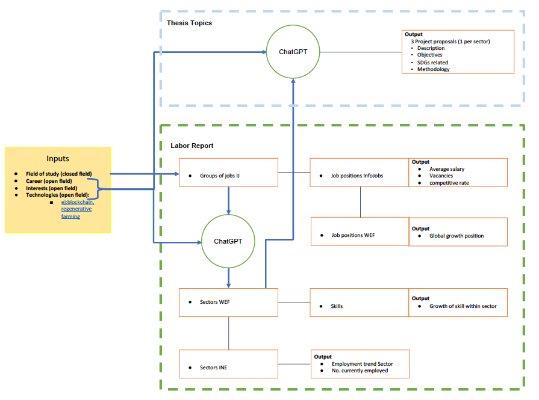

# Student Career Advisor

This repository provides a two-part tool designed to guide students in their career paths:

1. **AI Projects Module**  
   Uses **OpenAI ChatGPT** to generate tailored, study-aligned project ideas.  
   Each idea includes:
   - A project title  
   - A description  
   - Objectives to be achieved  
   - Related UN Sustainable Development Goals (ODS)  
   - A simple step-by-step plan  

2. **Data Insights Module**  
   Leverages real-world datasets from **InfoJobs**, **World Economic Forum (WEF)**, and **INE (Spain’s National Statistics Institute)** to build a personalized report for students.  
   It provides:
   - Top job roles matching the student’s field of study  
   - Sector growth/decline trends (global vs national)  
   - Expected skills in demand for chosen sectors  

---

## 📊 System Diagram

The overall workflow is illustrated below:

> If you need access to the **Google Sheets database** that powers this tool, please contact me directly.

---

## 🚀 Features

- Integrates **Google Sheets API** (private dataset, not public).  
- Analyzes jobs, sectors, and competencies to generate insights.  
- Uses **OpenAI GPT models** for AI-driven project recommendations.  
- Combines **data-driven** and **AI-driven** insights into one report.  

---

## 📦 Requirements

Install dependencies:

``bash
pip install -r requirements.txt
## 🔑 Configuration
Before running, set the following environment variables:

bash
export SERVICE_ACCOUNT_FILE=/path/to/service-account.json
export SPREADSHEET_ID=<your_spreadsheet_id>
export OPENAI_API_KEY=<your_api_key>
Alternatively, create a .env file (not committed to GitHub):

env
SERVICE_ACCOUNT_FILE=/path/to/service-account.json
SPREADSHEET_ID=your_spreadsheet_id
OPENAI_API_KEY=your_api_key
## ▶️ Usage
Run the main script:

bash
python src/main.py
It will:

Analyze your student profile and suggest 3 relevant sectors.

Generate project ideas tailored to your background.

Print a report with:

Top job roles

Expected sector trends

Growing competencies

AI-generated projects

## 🔐 Security
API keys and service account credentials are never stored in the repository.

These must be provided via environment variables or .env file.

The underlying Google Sheets data is private. Message me if you need access.
